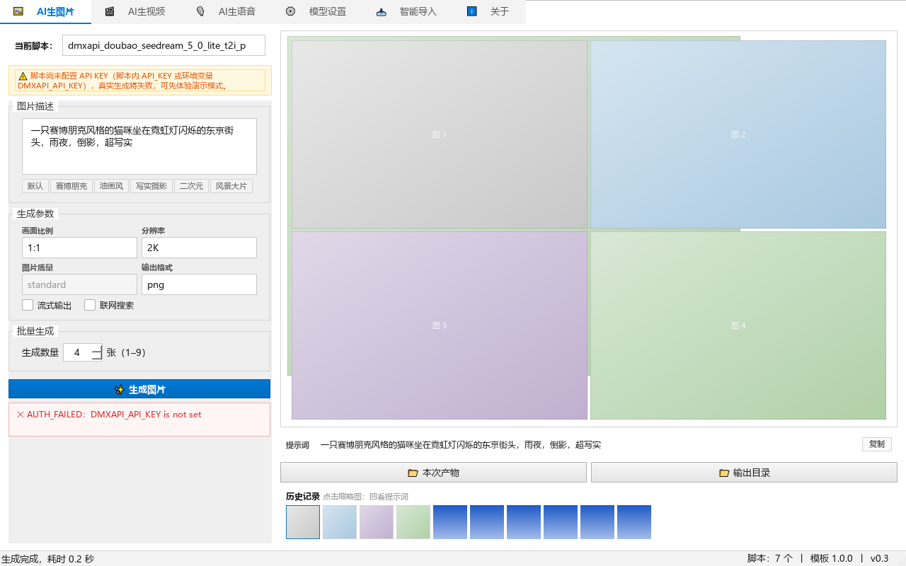
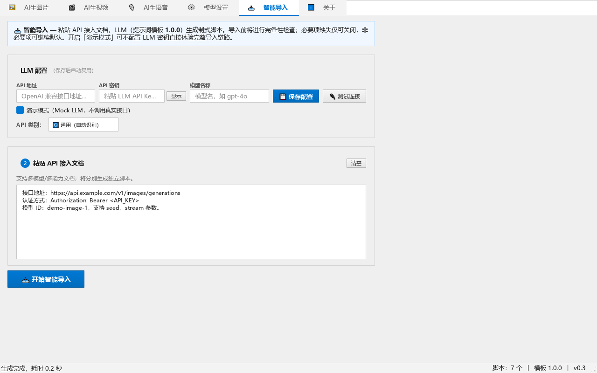

# AICreativeStudio · AI影音创造工坊

一个在电脑上用的 AI 创作小工具，帮你做图片、做视频、做配音。

它本身不会"画图"也不会"配音"——真正干活的是**脚本**（软件自动生成的一小段程序）。你只要把某个 AI 模型官网的接入文档粘进软件，它就能自动写好对应的脚本；之后你在界面里点点按钮，图片、视频、配音就出来了。全程不需要你写代码。

> ⚠️ **当前为 v0.5.1 版**：还有很多小毛病，界面也还粗糙，欢迎提意见帮它改进（可以到 Issues 页面反馈）！

## 🖼 界面预览

**AI 生图片** —— 写提示词、选参数，生成结果直接在预览宫格中查看：



**智能导入** —— 粘贴 AI 模型官网的接入文档，它会自动读懂并写出一份脚本：



## 📜 更新日志

| 版本 | 说明 |
|---|---|
| v0.1 | 第一个版本 |
| v0.2 | 改了整体做法：从"软件内置功能"改成"靠脚本干活" |
| v0.3 | 第一个公开版本（用 Kimi K3 和 GLM-5.3 重写了一遍） |
| v0.4 | 界面变好看（页签换成图标、复选框加了对勾、滚动条换成浅色），顺手修掉 9 个界面小毛病 |
| v0.5 | 修掉 9 个内部错误（脚本中文名丢失、生成的文件名多出一个 .py、设置文件多一项就崩溃、下载 FFmpeg 卡住不动、历史记录偶尔打不开等）；把进度条、滑块、菜单、提示小方块等样式统一；修正"软件依赖"里错误地多出一个叫 none 的假依赖 |
| v0.5.1 | 修复「生成视频总是失败」：程序原来只肯等 30 秒，而视频生成有时候要 40 多秒才出结果，时间一到就被误判成失败了。现在放宽到最多等 10 分钟，并把软件里其它几处"等得太短"的地方一并改正；同时修补了生成脚本用的模板，避免以后新写的脚本再犯一样的错 |

## ✨ 功能一览

- **自动写脚本**：在「智能导入」页填好 AI 模型的网址和密钥，把任意模型官网的接入文档粘进来，它会自己读懂并写出对应的脚本——想接入一个新模型，不用写一行代码
- **三个创作页**：AI 生图片 / AI 生视频 / AI 生语音，都能填参数、看结果
- **历史记录**：做过的图片、视频、配音都会存下来，点缩略图就能回看，用过的提示词也能一键填回去
- **模型密钥管理**：在「模型设置」页给想用的脚本填上密钥就行，支持代码折叠查看，改了没保存会提醒你
- **运行环境自检**：缺什么会主动提示你，FFmpeg（处理视频要用到的小工具）可以一键下载

## 📥 下载安装

从 [Releases](https://github.com/bruce609685-collab/AICreativeStudio/releases) 下载最新的 zip 压缩包，**解压就能用**（不用安装，支持 Windows 10 / 11）。

**第一次用**：

1. 打开「智能导入」页，填好你要用的 AI 模型的接口地址和密钥
2. 打开「模型设置」页，给想用的脚本填上密钥
3. 打开生成页，写提示词、选参数、点生成

## 🚀 从源码运行

（这一节是给想改代码的人看的，普通使用请直接下载上面的压缩包。）

```bash
git clone https://github.com/bruce609685-collab/AICreativeStudio.git
cd AICreativeStudio
pip install -r requirements.txt
python main.py
```

## 📂 项目结构

```
AICreativeStudio/
├── main.py          # 整个软件从这一个文件启动
├── about.py         # 软件的"身份证"（名称 / 版本 / 作者 / 发布页）
├── scripts/         # 脚本目录（图片 / 视频 / 配音三类，官方自带 7 个）
├── templates/       # 生成脚本时给 AI 看的模板
├── ui/              # 界面代码（6 个页签 + 各种小控件）
├── core/            # 主要功能（找脚本、跑脚本、导入文档）
├── contract/        # 软件和脚本之间的"约定"（两边怎么对话）
├── infra/           # 底层支撑（存历史记录、联网、处理媒体文件）
├── domain/          # 数据模型
├── tests/           # 自动化测试（88 项）
├── docs/            # 界面截图（README 里用到）
└── packaging/       # 打包成 exe 用的配置，以及整理发布包的小脚本
```

## 🛠 技术栈

| 部分 | 用了什么 |
|---|---|
| 语言 | Python 3.12 |
| 界面 | PySide6（Qt） |
| 数据保存 | SQLite（一个轻量数据库，文件自带，不用单独装） |
| 打包 | PyInstaller（打包成解压即用的文件夹） |

软件内部做了分层：负责具体功能的几个目录（domain / contract / infra / core）不依赖界面库，只有 ui / 是界面代码；脚本和主程序是分开运行的，脚本就算中途出错崩掉，也不会把主程序一起带崩。

## 🔒 安全说明

- 请勿把你的密钥（API KEY）提交到公开仓库

## 📄 License

本项目基于 **GNU GPL v3** 开源：

- ✅ 可以随意复制、修改、分发（含商用）
- ⚠️ 所有衍生作品必须以 GPL v3 同样开源，**不能闭源**
- ⚠️ 必须保留原作者版权声明

完整许可文本见 [LICENSE](LICENSE)。
